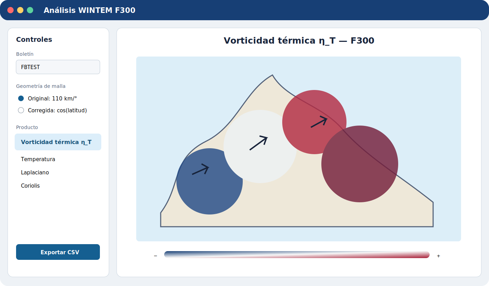

# WINTEM F300 Analysis

Aplicación de escritorio para decodificar boletines WINTEM, construir una malla regional del nivel F300 y calcular la vorticidad térmica asociada al campo de temperatura.

La versión original mezclaba Tkinter, Basemap, parsing y cálculo en dos scripts. Este repositorio separa esas responsabilidades en un paquete instalable, reemplaza Basemap por Cartopy y permite probar el cálculo sin abrir una interfaz gráfica.

> La página de GitHub Pages es documentación. La aplicación sigue ejecutándose localmente porque esta es la **opción A** de arquitectura.

## Fórmula científica

El diagnóstico principal es:

\[
\eta_T = \frac{g}{f}\left(\frac{\partial^2 T}{\partial x^2} + \frac{\partial^2 T}{\partial y^2}\right)
\]

donde `g` es la gravedad, `f = 2Ω sin(φ)` es el parámetro de Coriolis y las derivadas se aproximan con diferencias finitas centradas.

Para reproducir el material original se mantienen como valores predeterminados:

- `g = 9.8 m s⁻²`
- `Ω = 7.2 × 10⁻⁵ rad s⁻¹`
- `1 KT = 0.5 m s⁻¹`
- `1 grado = 110 km`
- Banda ecuatorial excluida: `|φ| ≤ 5°`

La interfaz permite cambiar al modo zonal corregido, `Δx(φ) = Δλ × 110 km × cos(φ)`, sin alterar la opción histórica.

## Vista de la aplicación



La imagen es una vista de referencia. La apariencia exacta de Tkinter depende del sistema operativo.

## Estructura

```text
wintem-f300-analysis/
├── README.md
├── LICENSE
├── requirements.txt
├── requirements-dev.txt
├── pyproject.toml
├── src/wintem_f300/
│   ├── core/
│   │   ├── parser.py
│   │   └── analysis.py
│   ├── gui/app.py
│   ├── export.py
│   └── plotting.py
├── tests/
├── examples/
├── docs/
└── .github/workflows/
```

## Requisitos

- Python 3.11, 3.12 o 3.13 con soporte para Tk.
- Git, únicamente para publicar o colaborar.
- Conexión a internet durante la instalación y, potencialmente, la primera carga de recursos Natural Earth de Cartopy.

Se recomienda Python 3.12 para igualar el entorno habitual de CI y maximizar la disponibilidad de ruedas binarias geoespaciales.

## Instalación

### Windows PowerShell

```powershell
cd C:\ruta\a\wintem-f300-analysis
py -3.12 -m venv .venv
.\.venv\Scripts\Activate.ps1
python -m pip install --upgrade pip
python -m pip install -r requirements.txt
python -m pip install -e .
```

Si PowerShell bloquea la activación del entorno, puede ejecutar directamente `.\.venv\Scripts\python.exe` en los comandos siguientes.

### Linux o macOS

```bash
cd /ruta/a/wintem-f300-analysis
python3.12 -m venv .venv
source .venv/bin/activate
python -m pip install --upgrade pip
python -m pip install -r requirements.txt
python -m pip install -e .
```

En algunas distribuciones Linux se debe instalar previamente el paquete del sistema `python3-tk`.

## Ejecución

Con el entorno activado:

```text
wintem-f300
```

Alternativa equivalente:

```text
python -m wintem_f300
```

Abra `examples/wintem_f300_example.txt`, seleccione un producto y exporte las tablas o la figura cuando lo necesite.

## Generar y publicar el informe estático

El generador procesa el WINTEM en el computador local y reemplaza el contenido generado de
`docs/` por HTML, PNG y CSV. GitHub Pages solo entrega esos archivos; no ejecuta Python ni
mantiene un servidor de la aplicación.

Desde PowerShell:

```powershell
powershell -NoProfile -ExecutionPolicy Bypass -File .\build_static_site.ps1 `
  "C:\ruta\al\WINTEM.txt"
```

La política `Bypass` se aplica únicamente a ese proceso de PowerShell. También puede evitar
scripts de PowerShell y ejecutar directamente:

```powershell
$env:PYTHONPATH = "src"
.\.venv\Scripts\python.exe -m wintem_f300.static_site "C:\ruta\al\WINTEM.txt" --output docs
```

Revise `docs/index.html` localmente y publique los cambios de `docs/` en la rama `main`. El
workflow incluido sube esa carpeta a Pages sin instalar dependencias ni recalcular resultados.

Productos generados:

- `docs/index.html`: informe adaptable a computador y teléfono.
- `docs/assets/figures/*.png`: mapas regionales y mallas de cada boletín.
- `docs/data/resultados_eta_f300.csv`: diagnóstico por observación.
- `docs/data/resumen_eta_por_boletin.csv`: estadísticos por boletín.

## Pruebas

Con `unittest`, sin dependencias de desarrollo adicionales:

```text
python -m unittest discover -s tests -v
```

Con pytest:

```text
python -m pip install -r requirements-dev.txt
python -m pytest
```

Las pruebas verifican parsing, malla, derivadas de un campo cuadrático, Coriolis, la fórmula de `eta_temperature`, la máscara ecuatorial y datos contradictorios. Ninguna prueba importa Tkinter.

## Sustitución de `wintem_f300_gui`

El import anterior:

```python
from wintem_f300_gui import Bulletin, WintemPoint, parse_wintem
```

se reemplaza por:

```python
from wintem_f300.core.parser import Bulletin, WintemPoint, parse_wintem
```

El cálculo se importa independientemente:

```python
from wintem_f300.core.analysis import GridConfig, build_analysis_grid
```

Por tanto, `wintem_f300_gui.py` ya no es un módulo requerido ni debe copiarse junto al paquete.

## Inicializar Git y subir a GitHub

En Windows, si `git` o `gh` no están instalados:

```powershell
winget install --id Git.Git -e
winget install --id GitHub.cli -e
```

Cierre y vuelva a abrir la terminal. Después, desde la raíz de este repositorio:

```powershell
git init
git branch -M main
git add .
git commit -m "Initial WINTEM F300 analysis release"
gh auth login
gh repo create wintem-f300-analysis --public --source=. --remote=origin --push
```

Si prefiere la interfaz web:

1. Cree un repositorio vacío llamado `wintem-f300-analysis` en GitHub, sin README ni licencia.
2. Copie la URL que GitHub muestra.
3. Ejecute:

```text
git init
git branch -M main
git add .
git commit -m "Initial WINTEM F300 analysis release"
git remote add origin https://github.com/USUARIO/wintem-f300-analysis.git
git push -u origin main
```

## Activar GitHub Pages

1. Abra el repositorio en GitHub.
2. Entre en **Settings → Pages**.
3. En **Build and deployment**, seleccione **GitHub Actions**.
4. Abra **Actions → Publicar documentación en GitHub Pages** y pulse **Run workflow** si no se inició automáticamente.
5. Espere a que el workflow finalice correctamente.

La dirección será:

```text
https://USUARIO.github.io/wintem-f300-analysis/
```

La URL concreta depende del propietario del repositorio y solo existe después del primer despliegue.

## Limitaciones conocidas

- El parser espera encabezados `FB... KWBC` y grupos WINTEM compatibles con el formato del proyecto original.
- La malla combinada debe tener separación regular y al menos tres latitudes y tres longitudes.
- No se interpolan huecos; los bordes y celdas sin vecinos válidos producen `NaN`.
- Si dos boletines ofrecen temperaturas diferentes en una misma coordenada, el análisis se detiene.
- Cartopy puede descargar datos Natural Earth en el primer uso de costas o fronteras.

## Checklist de entrega

- [ ] `python -m pip install -r requirements.txt` termina sin errores.
- [ ] `python -m pip install -e .` instala el comando `wintem-f300`.
- [ ] `python -m unittest discover -s tests -v` supera todas las pruebas.
- [ ] `python -m wintem_f300` abre la aplicación.
- [ ] El archivo de ejemplo se procesa y produce valores válidos de η_T.
- [ ] Se pueden exportar CSV y guardar una figura.
- [ ] No existe ningún import de `wintem_f300_gui`.
- [ ] Los workflows CI y Pages aparecen en verde en GitHub.
- [ ] La documentación abre desde otro computador mediante la URL de Pages.

## Licencia

[MIT](LICENSE).
